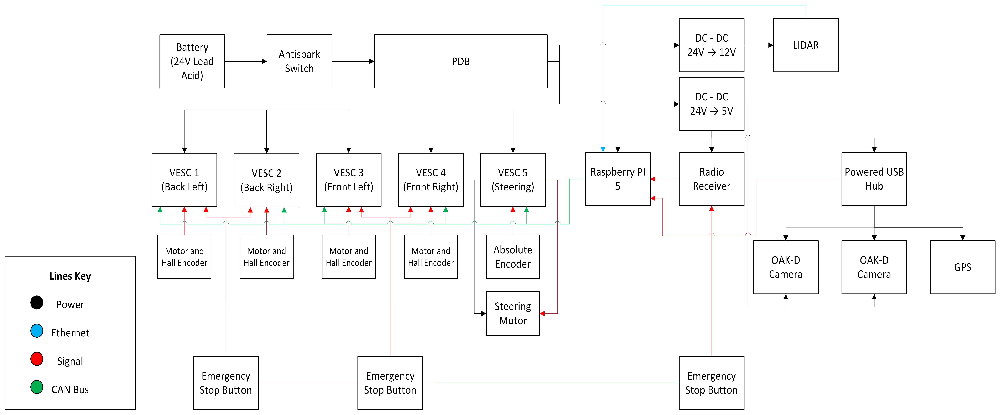

# Jeepbot

Jeepbot is an embedded robotics project focused on onboard perception, sensing, and future autonomy integration using a Raspberry Pi and OAK-D cameras.

Brent Brewster - Electrical & Computer Engineering
Keenai Braun - Mechanical & Aerospace Engineering
Yves Mojica - Electrical & Computer Engineering
Dylan Lee - Mechanical & Aerospace Engineering

## Current Progress

So far, this project includes:
- Raspberry Pi environment setup
- Python virtual environment for DepthAI
- OAK-D camera connectivity testing
- Basic RGB camera feed validation
- Initial depth/stereo experimentation
- Planning for multi-camera integration

## Hardware

- Raspberry Pi
- Luxonis OAK-D / OAK-D Pro cameras
- USB connection to Pi
- Optional future motor control / drive system hardware

## Software Stack

- Python 3
- DepthAI
- OpenCV
- Raspberry Pi OS
- Virtual environment (`venv`)

## System Schematic



## Repository Structure

```text
148-jeepbot-team-01/
├── .gitignore
├── README.md
├── requirements.txt
├── docs/
│   ├── project_overview.md
│   ├── hardware.md
│   ├── software_architecture.md
│   ├── troubleshooting.md
│   ├── system_schematic.md
│   └── system_schematic.png
├── setup/
│   ├── raspberry_pi_setup.md
│   └── depthai_setup.md
└── src/
    ├── main.py
    └── camera/
        ├── cam_test.py
        ├── depth_view.py
        └── dual_oakd_test.py
